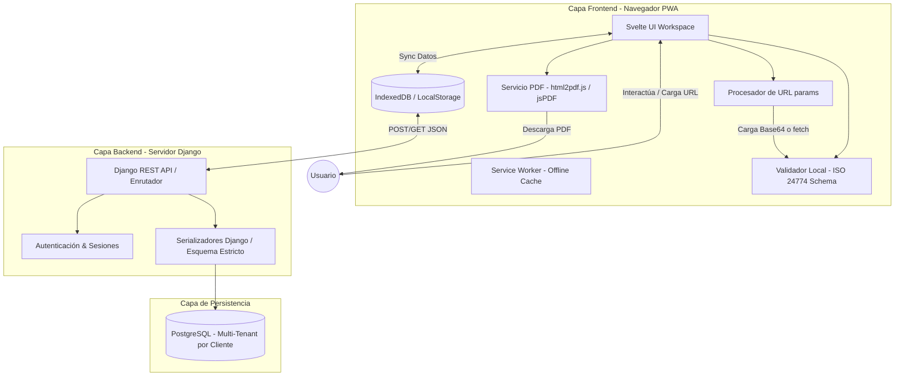
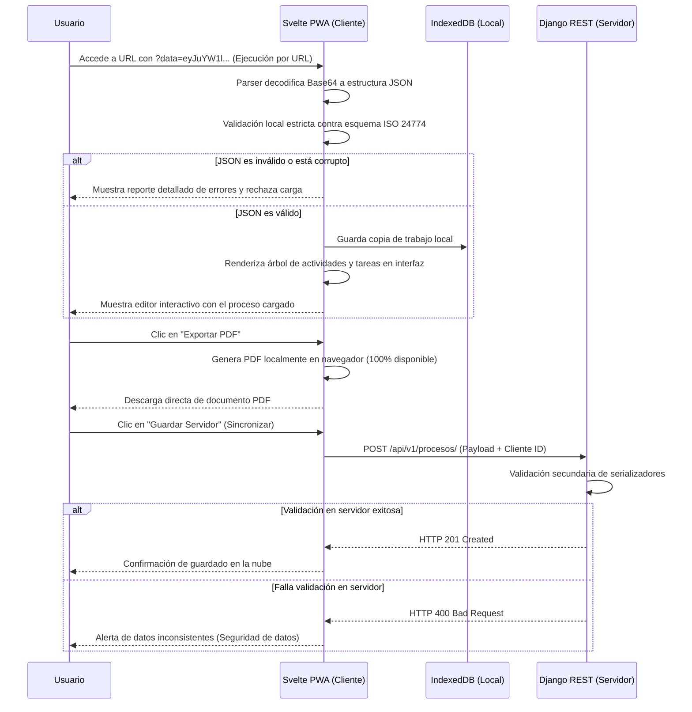
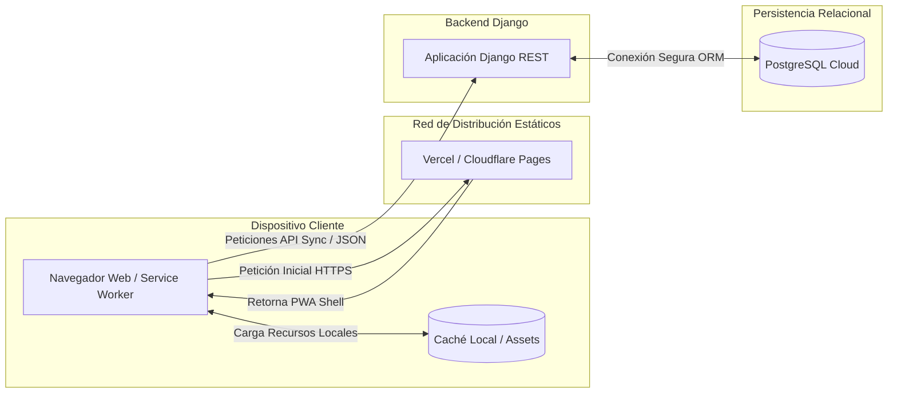

# Especificación de Arquitectura del Sistema (SAD)
**Proyecto:** Editor de Procesos según ISO/IEC/IEEE 24774  
**Procesos aplicados:** ISO/IEC/IEEE 12207:2026 (Cláusula 6.4.4)  
**Metodología de Desarrollo:** Cascada (Waterfall)  
**Arquitectura Seleccionada:** Cliente-Servidor Híbrida Offline-First (Svelte PWA + Django + PostgreSQL)
 
---
 
## Verificación de Salidas del Proceso (Outcomes Checklist - 6.4.4.2)
Como resultado de la ejecución de este proceso, se asegura y documenta el cumplimiento de las salidas exigidas por la norma:
- `[x]` **a)** El espacio del problema es refinado con respecto a las preocupaciones y perspectivas de los stakeholders. *(Ref: Actividad b.1)*
- `[x]` **b)** Alineación de la arquitectura con políticas, directivas, objetivos y restricciones (ISO/IEC/IEEE 24774). *(Ref: Actividad b.2 y d.2)*
- `[x]` **c)** Conceptos, propiedades, características o restricciones asignados a entidades arquitectónicas. *(Ref: Actividad e.1 - Matriz)*
- `[x]` **d)** Las preocupaciones identificadas de los stakeholders (100% disponibilidad, ejecución por URL, multi-cliente) son atendidas por la arquitectura del sistema. *(Ref: Actividades b.1 y d.2)*
- `[x]` **e)** Trazabilidad de los elementos de la arquitectura a los requisitos clave del sistema establecida. *(Ref: Actividad e.1)*
- `[x]` **f)** Vistas y modelos de la arquitectura del sistema desarrollados. *(Ref: Actividad c.2 - Diagramas Mermaid)*
- `[x]` **g)** Elementos del sistema y sus interfaces mutuas (API REST y query params) identificados. *(Ref: Actividad c.3)*
- `[x]` **h)** Sistemas habilitadores o servicios necesarios disponibles. *(Ref: Actividad a.4 y a.5)*
 
---
 
## Actividades del Proceso de Definición de Arquitectura (6.4.4.3)
Para dar cumplimiento formal a la norma, el diseño arquitectónico se ejecutó a través de las siguientes cinco actividades principales:
 
### a) Preparar la definición de la arquitectura del sistema
1.  **Definir la hoja de ruta y estrategia:** Diseñar una arquitectura híbrida **Cliente-Servidor con soporte Offline-First (PWA)**. Esto garantiza el **100% de disponibilidad** del editor en el navegador web del usuario, independientemente del estado de la red o del servidor backend.
2.  **Identificar y categorizar activos de arquitectura:** La jerarquía JSON definida por la norma ISO 24774 se utilizará como la plantilla estructural de intercambio de datos (archivos `.pro`) y validación estricta.
3.  **Formalizar la gobernanza arquitectónica:** El arquitecto de software controlará los esquemas JSON de carga/descarga y los serializadores del backend para asegurar un cumplimiento legal estricto.
4.  **Identificar y planificar sistemas habilitadores:** Se requiere soporte de Service Workers, almacenamiento local (IndexedDB) y bibliotecas de renderizado PDF en el cliente para mantener el aislamiento completo del sistema (SoS).
 
### b) Conceptualizar la arquitectura del sistema
1.  **Caracterizar el espacio del problema:** La empresa necesita levantar y documentar múltiples procesos para diversos clientes. La disponibilidad debe ser del 100%, sin depender de integraciones externas (SoS) y permitiendo la ejecución rápida del editor mediante parámetros en la URL.
2.  **Establecer objetivos y criterios de éxito:**
    - 100% de disponibilidad de la interfaz de edición básica.
    - Carga de procesos mediante parámetros de URL (`?data=` en Base64 o `?url=` para fetching remoto).
    - Segmentación estricta de datos por cliente y validación rigurosa de conformidad con ISO 24774.
3.  **Sintetizar soluciones potenciales:** Se evaluó un modelo web tradicional, pero se descartó porque ante caídas de servidor no cumpliría con el 100% de disponibilidad. Se optó por una SPA Offline-First basada en Svelte PWA.
4.  **Formular arquitecturas candidatas:** Svelte PWA (con local storage + IndexedDB) + Django + PostgreSQL.
 
### c) Elaborar la arquitectura del sistema
1.  **Seleccionar artefactos de arquitectura:** Vistas Lógicas, Vistas de Procesamiento (Secuencia) y Vistas de Despliegue Físico.
2.  **Desarrollar vistas y modelos:**
 
#### Vista Estructural Lógica (Diagrama de Componentes)
Muestra las responsabilidades desacopladas, destacando el motor de validación local y el generador de PDF standalone.
 

 
#### Vista de Procesamiento (Diagrama de Secuencia - Ejecución por URL y Validación)
Muestra cómo el sistema procesa una carga por URL, realiza la validación local estricta y sincroniza opcionalmente con el servidor.
 

 
#### Vista de Despliegue Físico (Diagrama de Infraestructura Standalone)
Demuestra el desacoplamiento físico y cómo la PWA garantiza la disponibilidad al 100%.
 

 
3.  **Definir fronteras e interfaces:** La interfaz crítica de comunicación es la API RESTful. La PWA consume los servicios de Django mediante llamadas asíncronas HTTP/HTTPS. En caso de desconexión, la PWA trabaja en aislamiento completo, cumpliendo con la restricción de SoS (sin depender de otros sistemas en ejecución).
 
### d) Evaluar la arquitectura del sistema
1.  **Definir criterios de evaluación:**
    - **Disponibilidad:** Debe ser del 100%. Resuelto mediante el uso de Svelte PWA y almacenamiento local en IndexedDB.
    - **Seguridad y Aislamiento:** El sistema no depende de integraciones externas (SoS), mitigando riesgos de seguridad de terceros.
    - **Portabilidad de datos:** Uso del formato `.pro` basado en un JSON Schema estricto.
2.  **Analizar y evaluar entidades (ADRs):**
    - **ADR-01 (Arquitectura Offline-First con PWA):** Para garantizar el 100% de disponibilidad, la aplicación compila estáticos optimizados y despliega un Service Worker que permite abrir el editor sin conexión a Internet, almacenando borradores en IndexedDB local.
    - **ADR-02 (Modelo Relacional con Columna JSONB y Clientes):** Para dar soporte a la necesidad de levantar múltiples procesos para múltiples clientes, la base de datos contendrá una relación explícita `CLIENTES 1---N PROCESOS`. Los metadatos de búsqueda se indexan relacionalmente, mientras que la estructura anidada ISO 24774 se guarda en una columna `JSONB` de PostgreSQL.
3.  **Seleccionar arquitectura preferida:** Svelte PWA + Django + PostgreSQL.
 
### e) Gestionar los resultados de la arquitectura
1.  **Asignar requisitos a entidades arquitectónicas:**
 
| Requisito del Sistema (SyRS 6.4.3) | Entidad Arquitectónica Asignada |
| :--- | :--- |
| **RF-01, RF-02, RF-07** (Edición UI) | `Svelte UI Renderer` |
| **RF-03, RF-04** (Carga y Descarga de plantilla `.pro`) | `Svelte UI Renderer` + `Django REST API` |
| **RF-05** (Ejecución por URL) | `Svelte UI Renderer` (Parámetros URL) |
| **RF-06** (Validación estricta ISO 24774) | `Django REST Serializers` + Validador Frontend |
| **RF-08** (Exportación a PDF) | `Document Rendering Service` (html2pdf.js) |
| **RNF-01** (Disponibilidad 100%) | Arquitectura Standalone / Offline-First |
| **RNF-02** (Ausencia de integraciones SoS) | Arquitectura Aislada Standalone |
| **RNF-03** (Restricción Legal ISO 24774) | Django Serializers & Frontend Validation |
| **RNF-04** (Compatibilidad Multicliente) | Estructura JSONB en PostgreSQL |
| **RNF-05** (Rendimiento Reactivo < 1s) | Svelte UI (Sin Virtual DOM) |
 
2.  **Capturar decisiones clave (Rationale):** La combinación de PWA para disponibilidad y Django para validación centralizada permite el balance ideal: autonomía total en el dispositivo del consultor cuando está en terreno ("100% disponible") y persistencia robusta multitenant cuando hay red.
3.  **Mantener concordancia:** Los esquemas de validación de Svelte y Django comparten la misma especificación del JSON Schema.
4.  **Establecer línea base:** Este documento constituye el Baseline arquitectónico definitivo que sella la fase 6.4.4.
5.  **Coordinar uso de la arquitectura:** El modelo documentado se transferirá a los equipos de desarrollo para dar inicio inmediato al diseño detallado (6.4.5).
