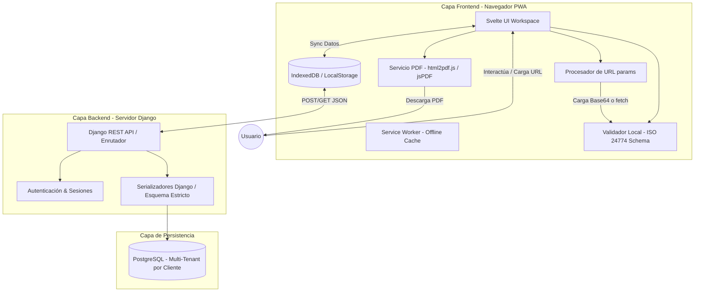
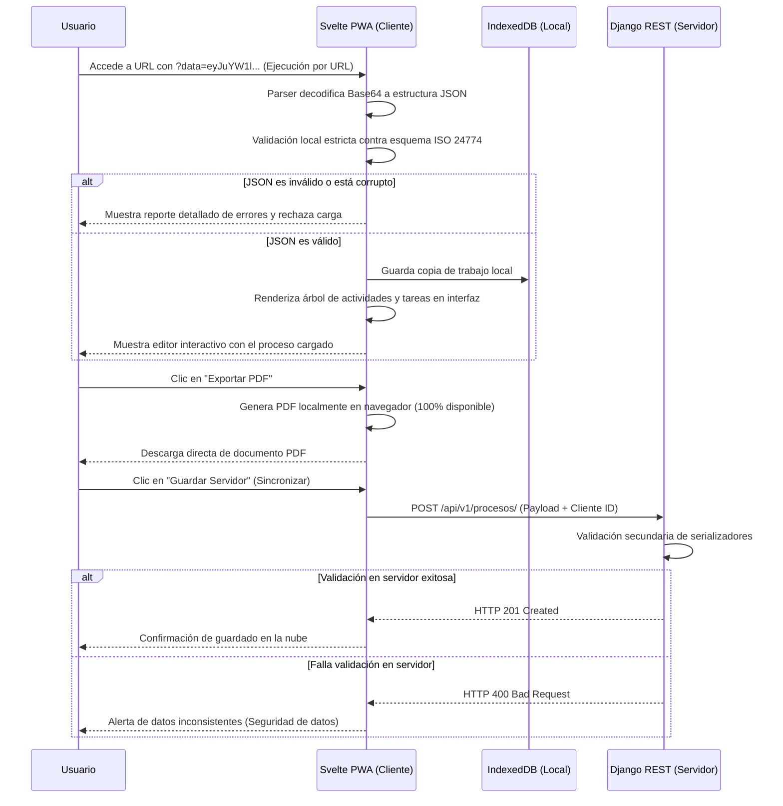
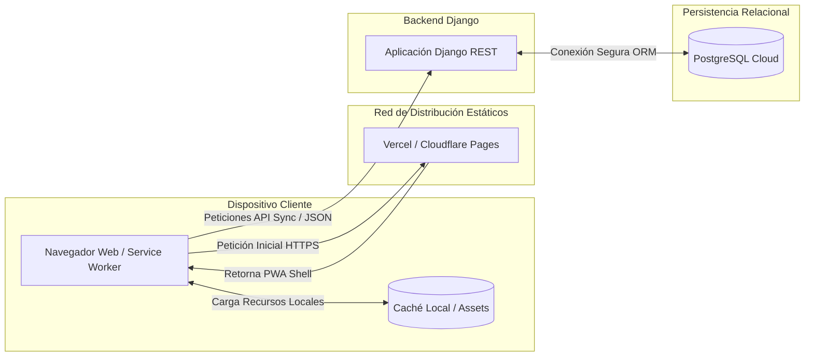
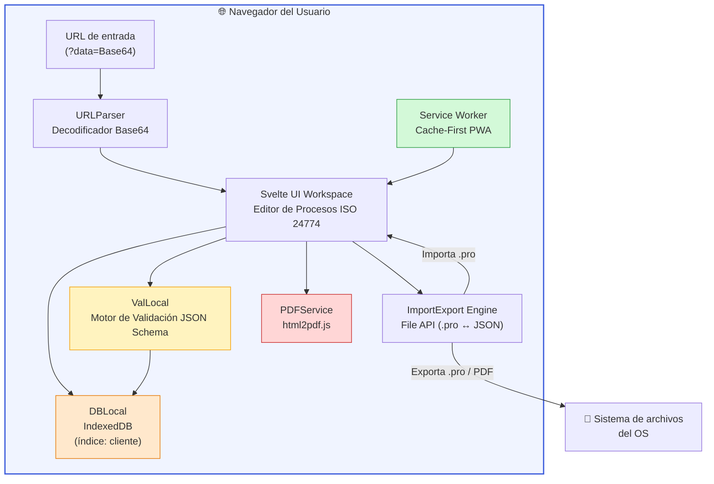
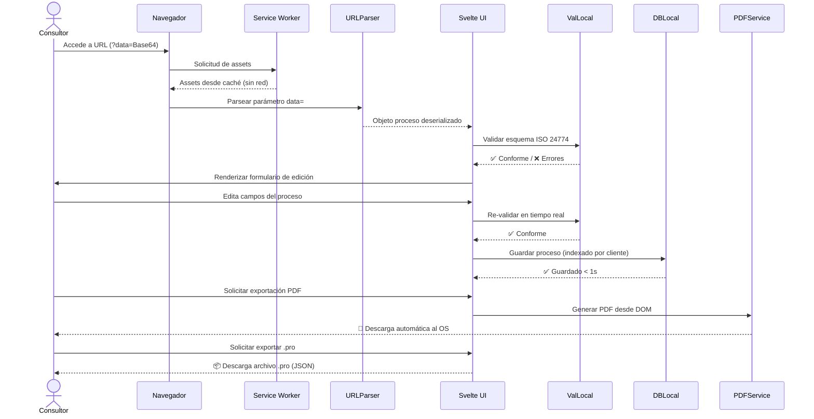
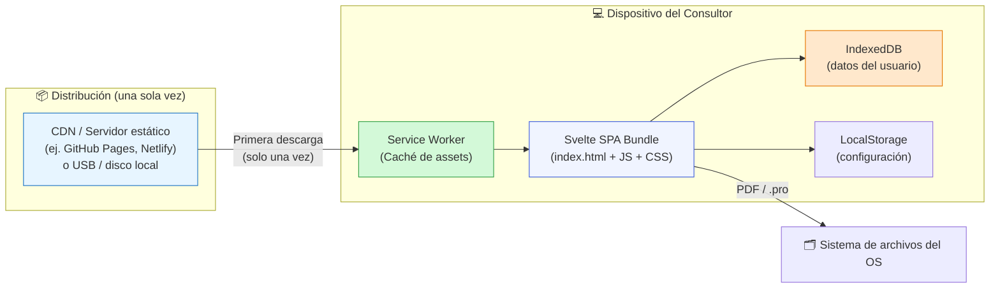

# Especificación de Arquitectura del Sistema (SAD)
**Proyecto:** Editor de Procesos según ISO/IEC/IEEE 24774  
**Procesos aplicados:** ISO/IEC/IEEE 12207:2026 (Cláusula 6.4.4)  
**Metodología de Desarrollo:** Cascada (Waterfall)  
**Arquitectura Seleccionada:** Cliente-Servidor Híbrida Offline-First (Svelte PWA + Django + PostgreSQL)
 
---
 
## Verificación de Salidas del Proceso (Outcomes Checklist - 6.4.4.2)
Como resultado de la ejecución de este proceso, se asegura y documenta el cumplimiento de las salidas exigidas por la norma:
- `[x]` **a)** El espacio del problema es refinado con respecto a las preocupaciones y perspectivas de los stakeholders. *(Ref: Actividad b.1)*
- `[x]` **b)** Alineación de la arquitectura con políticas, directivas, objetivos y restricciones (ISO/IEC/IEEE 24774). *(Ref: Actividad b.2 y d.2)*
- `[x]` **c)** Conceptos, propiedades, características o restricciones asignados a entidades arquitectónicas. *(Ref: Actividad e.1 - Matriz)*
- `[x]` **d)** Las preocupaciones identificadas de los stakeholders (100% disponibilidad, ejecución por URL, multi-cliente) son atendidas por la arquitectura del sistema. *(Ref: Actividades b.1 y d.2)*
- `[x]` **e)** Trazabilidad de los elementos de la arquitectura a los requisitos clave del sistema establecida. *(Ref: Actividad e.1)*
- `[x]` **f)** Vistas y modelos de la arquitectura del sistema desarrollados. *(Ref: Actividad c.2 - Diagramas Mermaid)*
- `[x]` **g)** Elementos del sistema y sus interfaces mutuas (API REST y query params) identificados. *(Ref: Actividad c.3)*
- `[x]` **h)** Sistemas habilitadores o servicios necesarios disponibles. *(Ref: Actividad a.4 y a.5)*
 
---
 
## Actividades del Proceso de Definición de Arquitectura (6.4.4.3)
Para dar cumplimiento formal a la norma, el diseño arquitectónico se ejecutó a través de las siguientes cinco actividades principales:
 
### a) Preparar la definición de la arquitectura del sistema
1.  **Definir la hoja de ruta y estrategia:** Diseñar una arquitectura híbrida **Cliente-Servidor con soporte Offline-First (PWA)**. Esto garantiza el **100% de disponibilidad** del editor en el navegador web del usuario, independientemente del estado de la red o del servidor backend.
2.  **Identificar y categorizar activos de arquitectura:** La jerarquía JSON definida por la norma ISO 24774 se utilizará como la plantilla estructural de intercambio de datos (archivos `.pro`) y validación estricta.
3.  **Formalizar la gobernanza arquitectónica:** El arquitecto de software controlará los esquemas JSON de carga/descarga y los serializadores del backend para asegurar un cumplimiento legal estricto.
4.  **Identificar y planificar sistemas habilitadores:** Se requiere soporte de Service Workers, almacenamiento local (IndexedDB) y bibliotecas de renderizado PDF en el cliente para mantener el aislamiento completo del sistema (SoS).
 
### b) Conceptualizar la arquitectura del sistema
1.  **Caracterizar el espacio del problema:** La empresa necesita levantar y documentar múltiples procesos para diversos clientes. La disponibilidad debe ser del 100%, sin depender de integraciones externas (SoS) y permitiendo la ejecución rápida del editor mediante parámetros en la URL.
2.  **Establecer objetivos y criterios de éxito:**
    - 100% de disponibilidad de la interfaz de edición básica.
    - Carga de procesos mediante parámetros de URL (`?data=` en Base64 o `?url=` para fetching remoto).
    - Segmentación estricta de datos por cliente y validación rigurosa de conformidad con ISO 24774.
3.  **Sintetizar soluciones potenciales:** Se evaluó un modelo web tradicional, pero se descartó porque ante caídas de servidor no cumpliría con el 100% de disponibilidad. Se optó por una SPA Offline-First basada en Svelte PWA.
4.  **Formular arquitecturas candidatas:** Svelte PWA (con local storage + IndexedDB) + Django + PostgreSQL.
 
### c) Elaborar la arquitectura del sistema
1.  **Seleccionar artefactos de arquitectura:** Vistas Lógicas, Vistas de Procesamiento (Secuencia) y Vistas de Despliegue Físico.
2.  **Desarrollar vistas y modelos:**
 
#### Vista Estructural Lógica (Diagrama de Componentes)
Muestra las responsabilidades desacopladas, destacando el motor de validación local y el generador de PDF standalone.
 

 
#### Vista de Procesamiento (Diagrama de Secuencia - Ejecución por URL y Validación)
Muestra cómo el sistema procesa una carga por URL, realiza la validación local estricta y sincroniza opcionalmente con el servidor.
 

 
#### Vista de Despliegue Físico (Diagrama de Infraestructura Standalone)
Demuestra el desacoplamiento físico y cómo la PWA garantiza la disponibilidad al 100%.
 

 
3.  **Definir fronteras e interfaces:** La interfaz crítica de comunicación es la API RESTful. La PWA consume los servicios de Django mediante llamadas asíncronas HTTP/HTTPS. En caso de desconexión, la PWA trabaja en aislamiento completo, cumpliendo con la restricción de SoS (sin depender de otros sistemas en ejecución).
 
### d) Evaluar la arquitectura del sistema
1.  **Definir criterios de evaluación:**
    - **Disponibilidad:** Debe ser del 100%. Resuelto mediante el uso de Svelte PWA y almacenamiento local en IndexedDB.
    - **Seguridad y Aislamiento:** El sistema no depende de integraciones externas (SoS), mitigando riesgos de seguridad de terceros.
    - **Portabilidad de datos:** Uso del formato `.pro` basado en un JSON Schema estricto.
2.  **Analizar y evaluar entidades (ADRs):**
    - **ADR-01 (Arquitectura Offline-First con PWA):** Para garantizar el 100% de disponibilidad, la aplicación compila estáticos optimizados y despliega un Service Worker que permite abrir el editor sin conexión a Internet, almacenando borradores en IndexedDB local.
    - **ADR-02 (Modelo Relacional con Columna JSONB y Clientes):** Para dar soporte a la necesidad de levantar múltiples procesos para múltiples clientes, la base de datos contendrá una relación explícita `CLIENTES 1---N PROCESOS`. Los metadatos de búsqueda se indexan relacionalmente, mientras que la estructura anidada ISO 24774 se guarda en una columna `JSONB` de PostgreSQL.
3.  **Seleccionar arquitectura preferida:** Svelte PWA + Django + PostgreSQL.
 
### e) Gestionar los resultados de la arquitectura
1.  **Asignar requisitos a entidades arquitectónicas:**
 
| Requisito del Sistema (SyRS 6.4.3) | Entidad Arquitectónica Asignada |
| :--- | :--- |
| **RF-01, RF-02, RF-07** (Edición UI) | `Svelte UI Renderer` |
| **RF-03, RF-04** (Carga y Descarga de plantilla `.pro`) | `Svelte UI Renderer` + `Django REST API` |
| **RF-05** (Ejecución por URL) | `Svelte UI Renderer` (Parámetros URL) |
| **RF-06** (Validación estricta ISO 24774) | `Django REST Serializers` + Validador Frontend |
| **RF-08** (Exportación a PDF) | `Document Rendering Service` (html2pdf.js) |
| **RNF-01** (Disponibilidad 100%) | Arquitectura Standalone / Offline-First |
| **RNF-02** (Ausencia de integraciones SoS) | Arquitectura Aislada Standalone |
| **RNF-03** (Restricción Legal ISO 24774) | Django Serializers & Frontend Validation |
| **RNF-04** (Compatibilidad Multicliente) | Estructura JSONB en PostgreSQL |
| **RNF-05** (Rendimiento Reactivo < 1s) | Svelte UI (Sin Virtual DOM) |
 
2.  **Capturar decisiones clave (Rationale):** La combinación de PWA para disponibilidad y Django para validación centralizada permite el balance ideal: autonomía total en el dispositivo del consultor cuando está en terreno ("100% disponible") y persistencia robusta multitenant cuando hay red.
3.  **Mantener concordancia:** Los esquemas de validación de Svelte y Django comparten la misma especificación del JSON Schema.
4.  **Establecer línea base:** Este documento constituye el Baseline arquitectónico definitivo que sella la fase 6.4.4.
5.  **Coordinar uso de la arquitectura:** El modelo documentado se transferirá a los equipos de desarrollo para dar inicio inmediato al diseño detallado (6.4.5).

# Entregables del Proceso de Definición de Arquitectura del Sistema
## ISO/IEC/IEEE 12207:2026 — Cláusula 6.4.4 System Architecture Definition Process

**Proyecto:** Editor de Procesos según ISO/IEC/IEEE 24774  
**Versión del Baseline:** 1.0  
**Fecha:** Junio 2026  
**Arquitectura seleccionada:** Aplicación Web Standalone 100% Cliente (Svelte SPA/PWA + IndexedDB)  
**Estado:** Baseline Aprobado

---

## Tabla de Contenidos

1. [Propósito y Alcance del Proceso](#1-propósito-y-alcance-del-proceso)
2. [Outcome a — Refinamiento del Espacio del Problema](#2-outcome-a--refinamiento-del-espacio-del-problema)
3. [Outcome b — Alineación con Políticas y Restricciones](#3-outcome-b--alineación-con-políticas-y-restricciones)
4. [Outcome c — Asignación de Conceptos y Propiedades a Entidades Arquitectónicas](#4-outcome-c--asignación-de-conceptos-y-propiedades-a-entidades-arquitectónicas)
5. [Outcome d — Atención a las Preocupaciones de los Stakeholders](#5-outcome-d--atención-a-las-preocupaciones-de-los-stakeholders)
6. [Outcome e — Trazabilidad Requisitos–Arquitectura](#6-outcome-e--trazabilidad-requisitosarquitectura)
7. [Outcome f — Vistas y Modelos de la Arquitectura](#7-outcome-f--vistas-y-modelos-de-la-arquitectura)
8. [Outcome g — Elementos del Sistema e Interfaces Internas](#8-outcome-g--elementos-del-sistema-e-interfaces-internas)
9. [Outcome h — Sistemas Habilitadores y Servicios Necesarios](#9-outcome-h--sistemas-habilitadores-y-servicios-necesarios)
10. [Registro de Decisiones de Arquitectura (ADRs)](#10-registro-de-decisiones-de-arquitectura-adrs)
11. [Verificación de Conformidad con la Norma](#11-verificación-de-conformidad-con-la-norma)

---

## 1. Propósito y Alcance del Proceso

### 1.1 Propósito

El propósito del proceso **6.4.4 System Architecture Definition** es generar una arquitectura del sistema que satisfaga los requisitos del sistema (SyRS) y que sirva como base para el diseño detallado. Este proceso define las entidades arquitectónicas, sus responsabilidades, sus interfaces y las decisiones de diseño que justifican la solución adoptada.

### 1.2 Alcance del Sistema

El sistema bajo diseño es un **Editor de Procesos ISO/IEC/IEEE 24774** que permite a consultores registrar, validar, exportar e importar definiciones de procesos en formato `.pro` (JSON Schema conforme a la norma). El sistema opera exclusivamente del lado del cliente, sin dependencias de red en tiempo de ejecución.

### 1.3 Contexto Operacional

| Atributo | Descripción |
|---|---|
| Tipo de usuario | Consultores de procesos de software e ingeniería de sistemas |
| Entorno de despliegue | Navegador web moderno (Chrome, Firefox, Edge, Safari) |
| Conectividad requerida | Solo para la descarga inicial (primera carga) |
| Modo de uso principal | Offline / campo / cliente remoto |
| Norma regulatoria | ISO/IEC/IEEE 24774:2021 (definición de procesos) |

---

## 2. Outcome a — Refinamiento del Espacio del Problema

> **Requisito normativo 6.4.4.2.a:** *"El espacio del problema es refinado con respecto a las preocupaciones y perspectivas de los stakeholders."*

### 2.1 Identificación de Stakeholders

| ID | Stakeholder | Rol en el sistema |
|---|---|---|
| SH-01 | Consultor de campo | Usuario primario: registra y exporta procesos |
| SH-02 | Cliente corporativo | Receptor de los reportes PDF y archivos `.pro` |
| SH-03 | Empresa consultora | Propietaria de la herramienta, requiere portabilidad y bajo costo |
| SH-04 | Comité ISO/IEC/IEEE | Estándar rector del formato y semántica de los procesos |

### 2.2 Preocupaciones y Perspectivas Identificadas

| ID | Preocupación | Stakeholder | Perspectiva Arquitectónica |
|---|---|---|---|
| C-01 | Disponibilidad sin conexión | SH-01, SH-03 | El sistema debe operar sin servidor backend |
| C-02 | Multi-cliente en un solo dispositivo | SH-01 | Organización local por cliente en IndexedDB |
| C-03 | Ejecución directa por URL | SH-01 | Carga de plantillas decodificando parámetros Base64 en la URL |
| C-04 | Privacidad de datos del proceso | SH-02, SH-03 | Ningún dato viaja por la red; procesamiento local estricto |
| C-05 | Conformidad con ISO 24774 | SH-03, SH-04 | Validación estricta con motor local en JavaScript |
| C-06 | Portabilidad entre dispositivos | SH-01 | Exportación/importación de archivos `.pro` (JSON Schema) |
| C-07 | Costo de infraestructura cero | SH-03 | Despliegue como sitio estático (CDN o disco local) |

### 2.3 Refinamiento del Problema

El problema central consiste en que los consultores necesitan una herramienta capaz de:

1. **Registrar procesos** conformes a ISO 24774 para múltiples clientes en un único dispositivo.
2. **Operar de manera autónoma** (offline), eliminando la necesidad de infraestructura de red en el sitio del cliente.
3. **Cargar plantillas preconfiguradas** a través de un enlace URL, sin requerir sesión, autenticación ni conexión activa.
4. **Exportar resultados** en formatos `.pro` (reutilizable) y PDF (legible por el cliente).

El espacio del problema excluye explícitamente: autenticación, gestión de usuarios, bases de datos centralizadas, integraciones con sistemas externos (SoS) y cualquier flujo de datos de red en tiempo de uso.

---

## 3. Outcome b — Alineación con Políticas y Restricciones

> **Requisito normativo 6.4.4.2.b:** *"La arquitectura está alineada con las políticas, directivas, objetivos y restricciones pertinentes."*

### 3.1 Restricciones Normativas

| ID | Restricción | Fuente | Impacto Arquitectónico |
|---|---|---|---|
| R-01 | Conformidad estricta con ISO/IEC/IEEE 24774:2021 | Norma regulatoria | El JSON Schema de los archivos `.pro` es el único formato válido |
| R-02 | Sin integración con Sistemas de Sistemas (SoS) | Requisito del cliente (SH-03) | Arquitectura 100% standalone, sin APIs de red externas |
| R-03 | Disponibilidad 100% garantizada | Requisito funcional crítico | Eliminación de todo servidor backend como punto único de fallo |

### 3.2 Políticas Arquitectónicas

| ID | Política | Descripción |
|---|---|---|
| P-01 | Privacy-by-Design | Ningún dato de proceso abandona el dispositivo del usuario |
| P-02 | Offline-First | El Service Worker garantiza el arranque sin red tras la primera descarga |
| P-03 | Schema-Strict Validation | El validador local `ValLocal` rechaza cualquier archivo `.pro` que no cumpla el esquema ISO 24774 |
| P-04 | Zero-Backend | No se permite introducir componentes de servidor (base de datos, API REST, autenticación) en este sistema |

### 3.3 Objetivos Arquitectónicos y Criterios de Éxito

| Objetivo | Criterio de éxito medible |
|---|---|
| Disponibilidad | 100% de disponibilidad tras la primera carga (sin red) |
| Rendimiento | Guardado y validación local < 1 segundo |
| Portabilidad | Transferencia completa de datos mediante archivos `.pro` sin pérdida de información |
| Despliegue | Distribución mediante un único bundle estático (HTML + JS + CSS) |
| Aislamiento | Cero llamadas de red durante la sesión de uso normal |

---

## 4. Outcome c — Asignación de Conceptos y Propiedades a Entidades Arquitectónicas

> **Requisito normativo 6.4.4.2.c:** *"Los conceptos, propiedades, características o restricciones son asignados a las entidades arquitectónicas."*

### 4.1 Catálogo de Entidades Arquitectónicas

| ID Entidad | Nombre | Tipo | Responsabilidad Principal |
|---|---|---|---|
| EA-01 | `Svelte UI Workspace` | Componente de presentación | Interfaz de usuario para edición de procesos ISO 24774 |
| EA-02 | `URLParser` | Módulo funcional | Decodificación de parámetros Base64 en la URL para carga de plantillas |
| EA-03 | `ValLocal` | Motor de validación | Validación estricta de conformidad con el esquema ISO 24774 |
| EA-04 | `ImportExport Engine` | Módulo funcional | Carga y descarga de archivos `.pro` (JSON Schema) |
| EA-05 | `DBLocal` | Capa de persistencia | Almacenamiento y recuperación en IndexedDB, organizado por cliente |
| EA-06 | `PDFService` | Módulo de exportación | Generación de reportes PDF usando `html2pdf.js` |
| EA-07 | `Service Worker` | Infraestructura PWA | Caché de assets para funcionamiento offline |

### 4.2 Asignación de Propiedades a Entidades

| Entidad | Propiedad / Característica | Restricción Aplicada |
|---|---|---|
| `Svelte UI Workspace` | Reactividad sin servidor | Sin llamadas fetch/XHR en tiempo de uso |
| `URLParser` | Decodificación Base64 nativa | Opera en el contexto del navegador sin librerías externas |
| `ValLocal` | Esquema JSON ISO 24774 embebido | El esquema es inmutable en tiempo de ejecución |
| `ImportExport Engine` | File API del navegador | Lectura/escritura mediante `FileReader` y `Blob` |
| `DBLocal` | IndexedDB API | Índice primario por propiedad `cliente` del objeto JSON |
| `PDFService` | Renderizado DOM-to-PDF | Sin servidor de impresión; generación 100% en cliente |
| `Service Worker` | Cache-First strategy | Assets cacheados en la primera visita; sin revalidación de red |

---

## 5. Outcome d — Atención a las Preocupaciones de los Stakeholders

> **Requisito normativo 6.4.4.2.d:** *"Las preocupaciones de los stakeholders son atendidas por la arquitectura."*

### 5.1 Matriz de Atención de Preocupaciones

| ID Preocupación | Descripción | Entidad(es) Responsable(s) | Mecanismo de Solución |
|---|---|---|---|
| C-01 | Disponibilidad sin conexión | `Service Worker` + Arquitectura Standalone | PWA con Cache-First; sin backend que pueda fallar |
| C-02 | Multi-cliente en un dispositivo | `DBLocal` | Índice por propiedad `cliente` en IndexedDB; lista y filtrado local |
| C-03 | Ejecución directa por URL | `URLParser` | Lee `?data=<base64>` al iniciar; hidrata el workspace sin red |
| C-04 | Privacidad de datos | Arquitectura 100% Cliente | Sin API de red; datos nunca salen del dispositivo |
| C-05 | Conformidad ISO 24774 | `ValLocal` | Validación con el JSON Schema oficial antes de cualquier guardado |
| C-06 | Portabilidad entre dispositivos | `ImportExport Engine` | Exportación/importación de archivos `.pro` via File API |
| C-07 | Costo de infraestructura cero | Arquitectura Standalone | Despliegue como bundle estático en CDN o servidor de archivos |

### 5.2 Evidencia de Cobertura

Todas las preocupaciones catalogadas (C-01 a C-07) tienen al menos una entidad arquitectónica asignada como responsable de su resolución. No existe preocupación sin cobertura arquitectónica. Esta cobertura completa constituye evidencia de conformidad con el outcome **d** de la norma.

---

## 6. Outcome e — Trazabilidad Requisitos–Arquitectura

> **Requisito normativo 6.4.4.2.e:** *"La trazabilidad de los elementos de la arquitectura a los requisitos clave del sistema está establecida."*

### 6.1 Matriz de Trazabilidad Requisitos ↔ Entidades Arquitectónicas

| ID Requisito | Descripción del Requisito | Entidad(es) Arquitectónica(s) | Tipo |
|---|---|---|---|
| RF-01 | Edición de campos de proceso ISO 24774 | `Svelte UI Workspace` | Funcional |
| RF-02 | Interfaz de usuario reactiva y accesible | `Svelte UI Workspace` | Funcional |
| RF-03 | Carga de plantilla `.pro` desde archivo local | `ImportExport Engine` | Funcional |
| RF-04 | Descarga del proceso editado como `.pro` | `ImportExport Engine` | Funcional |
| RF-05 | Ejecución e inicialización por URL con parámetro Base64 | `URLParser` | Funcional |
| RF-06 | Validación estricta de conformidad ISO 24774 | `ValLocal` | Funcional |
| RF-07 | Listado y selección de procesos por cliente | `Svelte UI Workspace` + `DBLocal` | Funcional |
| RF-08 | Exportación del proceso como documento PDF | `PDFService` | Funcional |
| RNF-01 | Disponibilidad 100% (offline-capable) | Arquitectura Standalone + `Service Worker` | No Funcional |
| RNF-02 | Ausencia de integraciones SoS (sin red en uso) | Política P-04 (Zero-Backend) | No Funcional |
| RNF-03 | Restricción legal de conformidad con ISO 24774 | `ValLocal` (esquema embebido) | No Funcional |
| RNF-04 | Compatibilidad multicliente en un dispositivo | `DBLocal` (índice por cliente) | No Funcional |
| RNF-05 | Rendimiento reactivo < 1s en operaciones locales | Ejecución local Svelte sin red | No Funcional |

### 6.2 Cobertura de Trazabilidad

| Métrica | Valor |
|---|---|
| Total de requisitos trazados | 13 (8 RF + 5 RNF) |
| Requisitos con entidad asignada | 13 / 13 |
| Cobertura | **100%** |
| Requisitos sin cobertura | 0 |

---

## 7. Outcome f — Vistas y Modelos de la Arquitectura

> **Requisito normativo 6.4.4.2.f:** *"Las vistas y modelos de la arquitectura del sistema son desarrollados."*

### 7.1 Vista Estructural Lógica (Diagrama de Componentes)

Muestra la organización interna de los módulos del sistema y cómo se relacionan dentro del navegador del usuario.

### 7.2 Vista de Procesamiento (Diagrama de Secuencia — Flujo Standalone por URL)

Describe la secuencia de ejecución cuando la aplicación es invocada mediante una URL que contiene datos codificados en Base64.

### 7.3 Vista de Despliegue Físico (Infraestructura Estática)

Muestra cómo se distribuye y ejecuta el sistema desde el punto de vista físico de la infraestructura.

> **Nota de disponibilidad:** Tras la primera descarga, el Service Worker intercepta todas las solicitudes de assets y las sirve desde la caché local. El sistema arranca y funciona completamente sin conexión a internet.

### 7.4 Resumen de Artefactos de Vistas

| Vista | Tipo de Diagrama | Propósito |
|---|---|---|
| Vista Estructural Lógica | Componentes | Organización interna de módulos en el navegador |
| Vista de Procesamiento | Secuencia | Flujo de ejecución por URL y ciclo de vida de uso |
| Vista de Despliegue Físico | Despliegue / Infraestructura | Distribución y operación offline |

---

## 8. Outcome g — Elementos del Sistema e Interfaces Internas

> **Requisito normativo 6.4.4.2.g:** *"Los elementos del sistema y sus interfaces mutuas son identificados."*

### 8.1 Catálogo de Interfaces Internas

| ID Interfaz | Origen | Destino | Protocolo / Mecanismo | Datos Transferidos |
|---|---|---|---|---|
| IF-01 | `URLParser` | `Svelte UI Workspace` | Llamada de función JS (objeto en memoria) | Objeto proceso JSON deserializado |
| IF-02 | `Svelte UI Workspace` | `ValLocal` | Llamada de función JS síncrona | Objeto proceso JSON para validar |
| IF-03 | `ValLocal` | `Svelte UI Workspace` | Retorno de función JS | Resultado de validación + lista de errores |
| IF-04 | `Svelte UI Workspace` | `DBLocal` | IndexedDB API (async) | Objeto proceso JSON + metadatos de cliente |
| IF-05 | `DBLocal` | `Svelte UI Workspace` | IndexedDB API (async) | Lista de procesos / objeto proceso individual |
| IF-06 | `Svelte UI Workspace` | `ImportExport Engine` | Evento DOM + File API | Archivo `.pro` o trigger de descarga |
| IF-07 | `ImportExport Engine` | `Svelte UI Workspace` | Callback / Promise | Objeto proceso JSON parseado |
| IF-08 | `Svelte UI Workspace` | `PDFService` | Llamada de función JS | Referencia al nodo DOM a convertir |
| IF-09 | `PDFService` | Sistema de archivos OS | Blob + `URL.createObjectURL` | Archivo PDF binario (descarga del navegador) |
| IF-10 | `Service Worker` | `Svelte UI Workspace` | Cache API + Fetch intercept | Assets estáticos cacheados |

### 8.2 Frontera del Sistema

La **frontera del sistema** es el navegador web. Todas las interacciones de entrada/salida del sistema con el exterior son:

| Canal | Dirección | Descripción |
|---|---|---|
| URL de entrada | Entrada | Parámetro `?data=<base64>` para carga de plantillas |
| Carga de archivo `.pro` | Entrada | Importación manual desde el sistema de archivos del OS |
| Descarga de archivo `.pro` | Salida | Exportación al sistema de archivos del OS |
| Descarga de archivo PDF | Salida | Reporte exportado al sistema de archivos del OS |
| Descarga inicial de assets | Entrada (1 vez) | Bundle estático desde CDN o servidor de archivos |

**No existen interfaces de red activas durante la sesión normal de uso.**

---

## 9. Outcome h — Sistemas Habilitadores y Servicios Necesarios

> **Requisito normativo 6.4.4.2.h:** *"Los sistemas habilitadores o servicios externos necesarios están disponibles."*

### 9.1 Sistemas Habilitadores Identificados

| ID | Sistema Habilitador | Proveedor | Disponibilidad | Rol en la Arquitectura |
|---|---|---|---|---|
| SE-01 | IndexedDB API | Navegador web moderno (estándar W3C) | Disponible en todos los targets (Chrome 24+, Firefox 16+, Safari 10+) | Persistencia local de procesos organizados por cliente |
| SE-02 | Service Worker API | Navegador web moderno (estándar W3C) | Disponible en todos los targets con HTTPS o localhost | Caché de assets para operación offline (PWA) |
| SE-03 | File API del navegador | Navegador web moderno (estándar W3C) | Ampliamente disponible | Lectura/escritura de archivos `.pro` desde/hacia el OS |
| SE-04 | `html2pdf.js` / `jsPDF` | Librería open-source (NPM) | Incluida en el bundle estático | Generación de PDF del lado del cliente |
| SE-05 | Svelte (compilador) | Framework open-source | Herramienta de build (no runtime) | Compilación a bundle JS estático en tiempo de desarrollo |
| SE-06 | Servidor de archivos estático | CDN (GitHub Pages, Netlify) o USB/disco local | 100% controlable por la empresa | Distribución del bundle para la primera descarga |

### 9.2 Análisis de Disponibilidad de Habilitadores

| ID | Sistema Habilitador | ¿Requiere red en uso? | ¿Punto único de fallo? | Mitigación |
|---|---|---|---|---|
| SE-01 | IndexedDB API | No | No (parte del navegador) | N/A |
| SE-02 | Service Worker API | No (post-instalación) | No | N/A |
| SE-03 | File API | No | No | N/A |
| SE-04 | `html2pdf.js` | No (embebido en bundle) | No | Incluido en el bundle estático |
| SE-05 | Svelte | No (solo build-time) | N/A | N/A (no es un runtime) |
| SE-06 | Servidor estático | Solo en primera descarga | Sí (solo en instalación) | Distribución alternativa por USB/disco |

Todos los sistemas habilitadores requeridos en tiempo de ejecución son APIs nativas del navegador o librerías embebidas en el bundle estático. **No existe dependencia de red ni de servicios externos durante la operación normal del sistema.**

---

## 10. Registro de Decisiones de Arquitectura (ADRs)

### ADR-01: Adopción de Arquitectura Standalone 100% Cliente

| Campo | Valor |
|---|---|
| **Fecha** | Junio 2026 |
| **Estado** | Aprobado — Baseline |
| **Contexto** | Se evaluaron dos alternativas: (a) Backend Django + PostgreSQL + Frontend React, y (b) Svelte SPA/PWA standalone. |
| **Decisión** | Se adopta la arquitectura **Svelte PWA Standalone 100% Cliente**. |
| **Justificación** | Un backend centralizado introduce puntos únicos de fallo incompatibles con el requisito RNF-01 (disponibilidad 100%). Además, viola la restricción RNF-02 (sin integraciones SoS) y genera costos de infraestructura y mantenimiento innecesarios para la empresa consultora. Svelte compila a un bundle estático autónomo que no requiere ningún servidor en ejecución. |
| **Consecuencias positivas** | Disponibilidad 100%, cero costo de infraestructura en runtime, privacidad absoluta de datos, operación en zonas sin conectividad. |
| **Consecuencias negativas** | Sin posibilidad de sincronización multi-dispositivo en tiempo real (fuera del alcance de este proyecto). La colaboración entre consultores se realiza mediante el intercambio de archivos `.pro`. |

### ADR-02: Persistencia con IndexedDB y Estructura por Cliente

| Campo | Valor |
|---|---|
| **Fecha** | Junio 2026 |
| **Estado** | Aprobado — Baseline |
| **Contexto** | Se requiere almacenamiento local que soporte múltiples registros de procesos para diferentes clientes en un mismo dispositivo. |
| **Decisión** | Se adopta **IndexedDB** como mecanismo de persistencia, con un object store de procesos indexado por la propiedad `cliente` del objeto JSON. |
| **Justificación** | LocalStorage es un simple par clave-valor inadecuado para datos estructurados complejos como los procesos ISO 24774. IndexedDB es el estándar W3C para almacenamiento estructurado en el navegador, con soporte para índices, transacciones y almacenamiento de hasta varios GB. El índice por `cliente` permite filtrar y listar procesos de forma eficiente sin necesidad de base de datos relacional. |
| **Consecuencias positivas** | Organización eficiente multicliente, transacciones ACID locales, sin límite práctico de almacenamiento para el volumen esperado. |
| **Consecuencias negativas** | Los datos son específicos del navegador y el dispositivo; la portabilidad se gestiona a través de los archivos `.pro`. |

### ADR-03: Validación Local con ValLocal y JSON Schema embebido

| Campo | Valor |
|---|---|
| **Fecha** | Junio 2026 |
| **Estado** | Aprobado — Baseline |
| **Contexto** | La validación de conformidad con ISO 24774 anteriormente se contempló distribuida entre cliente y servidor. |
| **Decisión** | Toda la lógica de validación se consolida en el módulo `ValLocal`, que embebe el JSON Schema de la norma ISO 24774 en el bundle estático. |
| **Justificación** | Al eliminar el servidor, la validación debe residir completamente en el cliente. La consolidación en un único módulo elimina redundancias, garantiza consistencia y permite rechazo inmediato de datos no conformes antes de persistir en IndexedDB. |
| **Consecuencias positivas** | Validación en tiempo real (< 1s), sin latencia de red, sin posibilidad de eludir validación al no existir backend. |
| **Consecuencias negativas** | Actualizaciones del JSON Schema de ISO 24774 requieren una nueva compilación y publicación del bundle. |

---

## 11. Verificación de Conformidad con la Norma

### 11.1 Checklist de Outcomes — 6.4.4.2

| Outcome | Descripción (6.4.4.2) | ¿Cubierto? | Sección de este documento |
|---|---|---|---|
| **a** | Refinamiento del espacio del problema con preocupaciones de stakeholders | ✅ Sí | Sección 2 |
| **b** | Alineación con políticas, directivas, objetivos y restricciones | ✅ Sí | Sección 3 |
| **c** | Conceptos, propiedades y restricciones asignados a entidades arquitectónicas | ✅ Sí | Sección 4 |
| **d** | Preocupaciones de stakeholders atendidas por la arquitectura | ✅ Sí | Sección 5 |
| **e** | Trazabilidad de elementos arquitectónicos a requisitos establecida | ✅ Sí | Sección 6 |
| **f** | Vistas y modelos de la arquitectura desarrollados | ✅ Sí | Sección 7 |
| **g** | Elementos del sistema e interfaces mutuas identificados | ✅ Sí | Sección 8 |
| **h** | Sistemas habilitadores o servicios necesarios disponibles | ✅ Sí | Sección 9 |

**Cobertura total: 8/8 outcomes cubiertos (100%)**

### 11.2 Checklist de Actividades — 6.4.4.3

| Actividad | Descripción (6.4.4.3) | ¿Ejecutada? | Evidencia |
|---|---|---|---|
| **a** | Preparar la definición de la arquitectura | ✅ Sí | ADR-01, ADR-02, ADR-03; Secciones 3.2, 9 |
| **b** | Conceptualizar la arquitectura del sistema | ✅ Sí | Secciones 2 y 3 |
| **c** | Elaborar la arquitectura del sistema | ✅ Sí | Secciones 7 y 8 (vistas, interfaces) |
| **d** | Evaluar la arquitectura del sistema | ✅ Sí | Sección 10 (ADRs con justificación y consecuencias) |
| **e** | Gestionar los resultados de la arquitectura | ✅ Sí | Secciones 4, 5, 6; Baseline declarado |

### 11.3 Declaración de Baseline

Este documento, junto con los diagramas de arquitectura referenciados, constituye el **Baseline v1.0** de la arquitectura del sistema del Editor de Procesos ISO/IEC/IEEE 24774. Servirá como guía directa para la codificación del editor standalone conforme a la metodología Cascada (Waterfall) adoptada por el proyecto.

---

*Documento generado conforme al proceso 6.4.4 System Architecture Definition — ISO/IEC/IEEE 12207:2026*  
*Proyecto: Editor de Procesos ISO/IEC/IEEE 24774 | Baseline v1.0 | Junio 2026*

