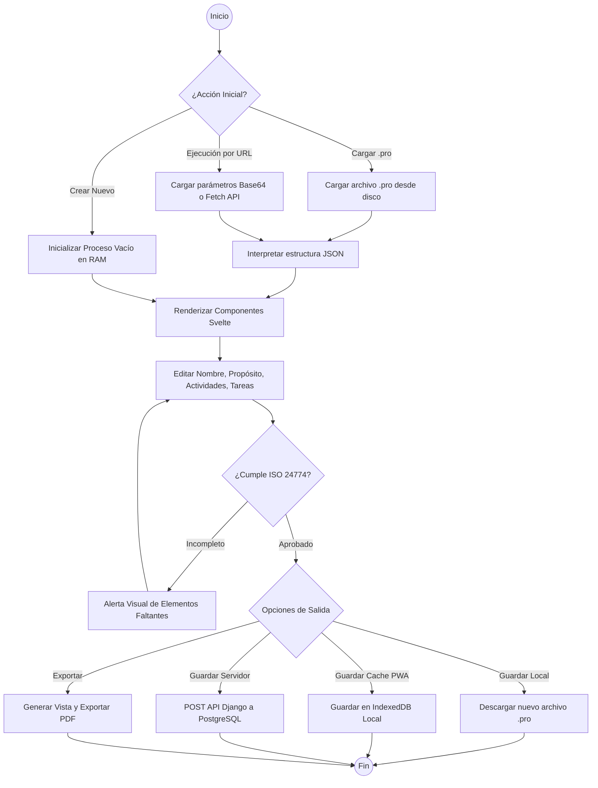
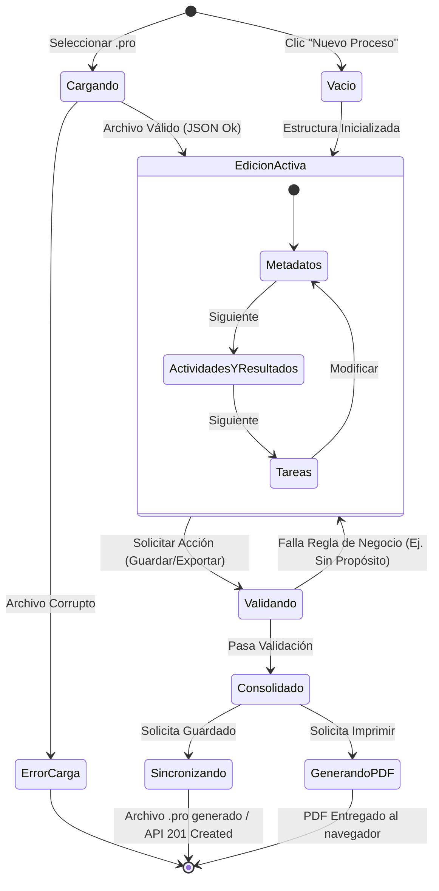
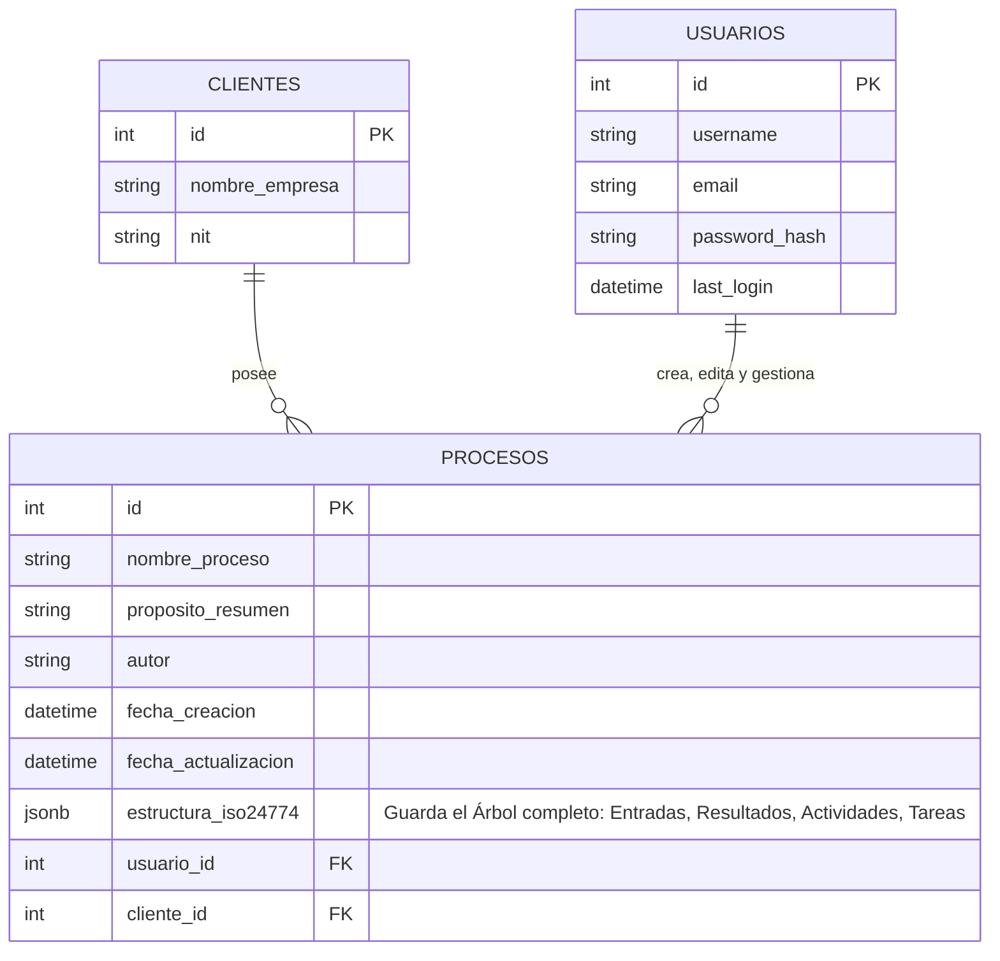
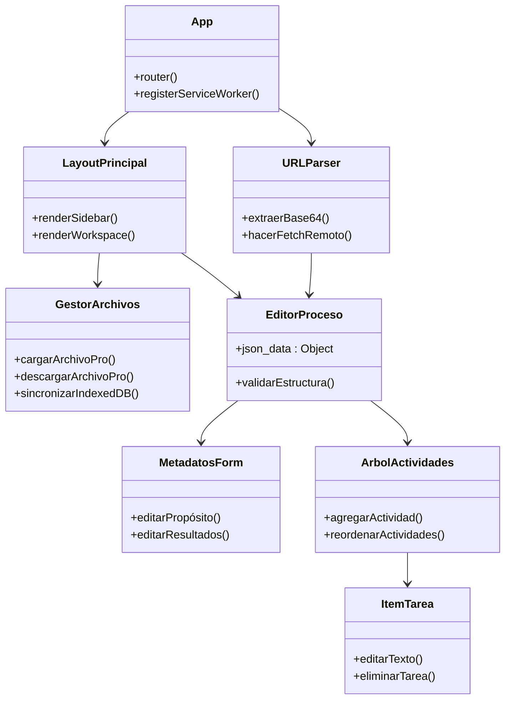
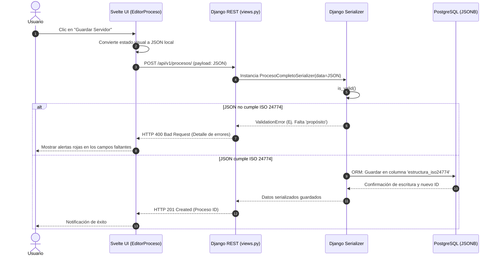

# Especificación de Diseño Detallado (Detailed Design)
**Proyecto:** Editor de Procesos Standalone según ISO/IEC/IEEE 24774
**Fase Metodológica:** Diseño Detallado (Detailed Design) - Modelo de Cascada Pura
**Proceso asociado:** ISO/IEC/IEEE 12207 - Cláusula 6.4.5 (Proceso de Definición de Diseño)

---

## 1. Alineación con el Modelo de Cascada Pura
De acuerdo con el ciclo de vida en cascada pura establecido para el proyecto, esta fase de **Diseño Detallado (Detailed Design)** se ejecuta estrictamente después de haber completado y congelado el Diseño Arquitectónico (Architectural Design - 6.4.4). En este punto, los requisitos (Requirements Analysis) y la arquitectura (Cliente-Servidor Híbrida Offline-First con Svelte PWA, Django y PostgreSQL) ya están definidos, y el objetivo es detallar las especificaciones a un nivel que permita el inicio inmediato de la fase de Codificación y Depuración (Coding and Debugging).

---

## 2. ISO/IEC/IEEE 12207 - 6.4.5 Proceso de Definición de Diseño

### 2.1 Resultados Esperados del Proceso (Outcomes - 6.4.5.2)
Como resultado de la ejecución exitosa de este proceso, se han logrado los siguientes propósitos formales de la norma:
- `[x]` **a)** Las características de diseño de cada elemento del sistema (Frontend y Backend) están definidas detalladamente.
- `[x]` **b)** Los requisitos del sistema se han asignado a elementos específicos de hardware/software y bases de datos.
- `[x]` **c)** Las interfaces entre los elementos del sistema (Endpoints API REST) han sido completamente diseñadas.
- `[x]` **d)** Se han capturado y documentado los artefactos de diseño que guiarán la programación.
- `[x]` **e)** Se ha establecido la trazabilidad desde las decisiones de diseño arquitectónico hasta los detalles de implementación (ERD, Swagger, Diagramas de Comportamiento).

### 2.2 Actividades y Tareas del Diseño (Activities and Tasks - 6.4.5.3)

#### a) Preparar la definición del diseño
*   **Tarea 1:** Revisar la línea base de la Especificación de Arquitectura del Sistema (SAD), asegurando la viabilidad del stack Svelte + Django.
*   **Tarea 2:** Determinar tecnologías de diseño de bajo nivel (UML, OpenAPI/Swagger para contratos REST, Mermaid para representación visual).

#### b) Establecer los diseños de cada elemento del sistema
*   **Tarea 1:** Diseñar las interfaces internas y externas. Se especifican los contratos JSON de la API para permitir la comunicación Frontend-Backend sin acoplamiento fuerte.
*   **Tarea 2:** Diseñar el modelo físico y lógico de datos. Se define un esquema híbrido en PostgreSQL (Relacional + JSONB) para optimizar el almacenamiento del archivo `.pro`.
*   **Tarea 3:** Diseñar la lógica de comportamiento y procesos del usuario. Se diagraman los flujos de validación de los elementos normativos exigidos por ISO 24774 (Propósito, Resultados, Actividades, Tareas).

#### c) Gestionar el diseño
*   **Tarea 1:** Establecer el documento de diseño como una nueva línea base antes de iniciar la programación.
*   **Tarea 2:** Asegurar que las validaciones de diseño cumplan con la métrica de rendimiento crítico (RNF-03: tiempo de respuesta < 2s).

---

## 3. Artefactos de Diseño Lógico y Físico

### 3.1 Diagrama de Proceso de Usuario (UML Activity Diagram)
Define el flujo paso a paso desde la perspectiva del usuario (Diseñador de Procesos) interactuando con la interfaz Svelte.



### 3.2 Diagrama de Comportamiento del Editor (UML State Machine)
Muestra los estados del proceso y cómo reacciona el sistema ante las validaciones estructurales de los componentes del proceso.



### 3.3 Modelado de Base de Datos (ERD Híbrido)
Dado el esquema arquitectónico seleccionado, se emplea un modelo híbrido en PostgreSQL. Los datos relacionales puros permiten consultas de administración, mientras que `JSONB` conserva intacta la jerarquía del proceso para rendimiento óptimo.



### 3.4 Especificación de Interfaz de Integración (Swagger / OpenAPI)
Contrato técnico formal entre el frontend (Svelte) y el backend (Django). Se utiliza el estándar OpenAPI 3.0 para que los desarrolladores inicien la fase de codificación de forma autónoma.

```yaml
openapi: 3.0.3
info:
  title: API Editor de Procesos ISO 24774
  description: Endpoints REST para validación estructural centralizada y almacenamiento de procesos (.pro).
  version: 1.0.0
servers:
  - url: 'http://localhost:8000/api/v1'
    description: Backend Django Local (Entorno de Desarrollo)
paths:
  /procesos/:
    get:
      summary: Obtener lista de procesos del usuario autenticado
      responses:
        '200':
          description: Respuesta exitosa
          content:
            application/json:
              schema:
                type: array
                items:
                  $ref: '#/components/schemas/ProcesoMetadata'
    post:
      summary: Crear y guardar un nuevo proceso (Payload tipo .pro)
      description: Recibe el árbol completo del proceso. Django valida el cumplimiento normativo antes de insertar en el JSONB de Postgres.
      requestBody:
        required: true
        content:
          application/json:
            schema:
              $ref: '#/components/schemas/ProcesoCompleto'
      responses:
        '201':
          description: Proceso estructurado guardado correctamente
        '400':
          description: Error estructural (Falta nombre, propósito o resultados esperados)
  /procesos/{id}/:
    get:
      summary: Cargar un proceso completo específico
      parameters:
        - in: path
          name: id
          required: true
          schema:
            type: integer
      responses:
        '200':
          description: Respuesta exitosa con el árbol JSON
          content:
            application/json:
              schema:
                $ref: '#/components/schemas/ProcesoCompleto'
components:
  schemas:
    ProcesoMetadata:
      type: object
      properties:
        id:
          type: integer
        nombre_proceso:
          type: string
        fecha_actualizacion:
          type: string
          format: date-time
    ProcesoCompleto:
      type: object
      required:
        - nombre
        - proposito
        - resultados_esperados
      properties:
        nombre:
          type: string
          description: Nombre del proceso
        proposito:
          type: string
          description: Propósito principal del proceso
        autor:
          type: string
        resultados_esperados:
          type: array
          description: Mínimo exigido por la norma
          items:
            type: string
        actividades:
          type: array
          items:
            type: object
            properties:
              nombre_actividad:
                type: string
              tareas:
                type: array
                items:
                  type: string
                  description: Descripción de cada tarea
```

---

## 4. Componentes Adicionales de Diseño ISO 12207

#### 4.1 Matriz de Trazabilidad de Diseño (Design Traceability Matrix)
Cumpliendo con el resultado `6.4.5.2 (e)`, esta matriz asegura que los requisitos del sistema y las decisiones de arquitectura estén cubiertos por elementos de código específicos.

| Req. SAD / Característica | Módulo/Elemento de Diseño Asignado | Tipo de Artefacto |
| :--- | :--- | :--- |
| **RF-01 a RF-06** (Edición UI) | Componentes `ProcessEditor.svelte`, `ActivityTree.svelte` | Frontend (Svelte PWA) |
| **RF-05** (Ejecución por URL) | Validador y Parser `URLParamsProcessor` | Frontend (Svelte PWA) |
| **RF-07, RF-08** (Archivo .pro) | Serializador `ProcesoCompletoSerializer` | Backend (Django) |
| **RF-09** (Validación ISO 24774)| Función `validate_iso24774_schema()` en Django Models | Backend (Django) |
| **RF-10 a RF-13** (Exportar PDF) | Servicio `PDFGeneratorService` invocable vía API | Backend (Python) |
| **RNF-01** (Disponibilidad 100%) | Service Worker (PWA) e `IndexedDB` local | Frontend (Svelte PWA) |
| **RNF-03** (Rendimiento < 2s) | Almacenamiento en `PostgreSQL` usando columna nativa `JSONB` | Base de Datos |
| **RNF-04** (Multi-cliente) | Relación Clave Foránea `cliente_id` en PostgreSQL | Base de Datos |
| **Seguridad y Persistencia** | Modelos `Usuario`, `Cliente` y `Proceso` en `models.py` | Backend (Django) |

#### 4.2 Diagrama de Clases y Componentes
Definición detallada de las piezas de software (Resultado `6.4.5.2 (a)`).

**Estructura de Componentes UI (Svelte):**


#### 4.3 Diagrama de Secuencia Detallado (Ciclo de Guardado)
Muestra la interacción a bajo nivel entre el cliente, el servidor y la base de datos (Resultado `6.4.5.2 (c)`).



#### 4.4 Diccionario de Datos: JSON Schema Estricto (Archivo `.pro`)
Este esquema es la "Ley" del sistema. Dicta exactamente qué es un proceso válido según ISO 24774. Será implementado tanto en las validaciones de Svelte como en los validadores de Django.

```json
{
  "$schema": "http://json-schema.org/draft-07/schema#",
  "title": "Proceso ISO/IEC/IEEE 24774",
  "description": "Estructura estándar de un archivo .pro generado por el editor",
  "type": "object",
  "required": ["nombre", "proposito", "resultados_esperados"],
  "properties": {
    "nombre": {
      "type": "string",
      "description": "Nombre descriptivo del proceso"
    },
    "proposito": {
      "type": "string",
      "description": "El objetivo principal del proceso"
    },
    "autor": {
      "type": "string"
    },
    "resultados_esperados": {
      "type": "array",
      "minItems": 1,
      "items": {
        "type": "string"
      },
      "description": "Lista de resultados tangibles al ejecutar el proceso"
    },
    "actividades": {
      "type": "array",
      "items": {
        "type": "object",
        "required": ["nombre_actividad", "tareas"],
        "properties": {
          "nombre_actividad": {
            "type": "string"
          },
          "tareas": {
            "type": "array",
            "minItems": 1,
            "items": {
              "type": "string"
            }
          }
        }
      }
    }
  }
}
```

#### 4.5 Mockup Estructural (Wireframe Layout)
Disposición visual proyectada para cumplir con la usabilidad sin exigir al usuario conocimientos técnicos (Atiende a RNF-01).

```mermaid
block-beta
  columns 4
  MenuNav["<b>Menú Lateral</b><br/>- Nuevo<br/>- Abrir .pro<br/>- Guardar<br/>- Exportar PDF"]
  EspacioPrincipal<["<b>Área de Trabajo Principal (Svelte Editor)</b><br/><br/><i>--- Metadatos ---</i><br/>[Input: Nombre del Proceso]<br/>[Textarea: Propósito]<br/>[Lista: Resultados Esperados (+)]<br/><br/><i>--- Flujo de Proceso ---</i><br/>[Actividad 1] (Arrastrable)<br/>  - Tarea 1.1<br/>  - Tarea 1.2<br/>[+ Agregar Actividad]"]>(3)
  
  MenuNav -- "Navegación rápida" --> EspacioPrincipal
```

#### 4.6 Soporte Offline-First y Aislamiento (PWA)
En respuesta a los requisitos de los stakeholders sobre el **100% de disponibilidad** y la ejecución por URL, el diseño frontend adopta un modelo Offline-First:
1. **Service Workers:** Se encargarán de cachear los assets estáticos (HTML, CSS, JS compilado de Svelte) para que el editor abra instantáneamente sin conexión.
2. **IndexedDB Local:** Actúa como la base de datos temporal. Cuando el usuario carga un proceso mediante `?data=` o sube un `.pro`, el estado de edición se auto-guarda en la caché del navegador para prevenir pérdida de datos.
3. **Sincronización Diferida:** El guardado hacia Django solo ocurre cuando hay conexión y el usuario lo solicita explícitamente ("Guardar Servidor").

#### 4.7 Decisiones de Adquisición vs. Desarrollo (Make vs. Buy)
Atendiendo al resultado `6.4.5.2 (f)` y `(g)` de la norma, se identifican qué artefactos de diseño serán desarrollados a medida y cuáles serán adquiridos o reutilizados:

| Componente | Decisión (Hacer / Reutilizar) | Justificación / Origen |
| :--- | :--- | :--- |
| **Motor de Base de Datos** | Reutilizar (Open Source) | Se utilizará PostgreSQL nativo. |
| **Framework Backend** | Reutilizar (Open Source) | Django y Django REST Framework. |
| **Framework de Interfaz UI** | Reutilizar (Open Source) | Svelte. |
| **Lógica de Validación ISO 24774**| **Hacer (Desarrollo Interno)** | No existe en el mercado un validador que encaje exactamente con las reglas de completitud del archivo `.pro`. |
| **Mecanismo Drag & Drop** | Reutilizar / Adaptar | Se integrará una librería JS (ej. SortableJS) para la reorganización de tareas. |
| **Generador de Reportes PDF** | **Hacer (Desarrollo Interno)** | El layout del PDF requiere una maquetación institucional específica para este modelo de procesos. |

---

## 5. Cierre y Establecimiento de la Línea Base (Baseline)
1. **Verificación de Habilitadores (Design Enablers):** Se confirma que los entornos de desarrollo de Svelte, Python/Django y PostgreSQL están disponibles y operativos. *(Cumple 6.4.5.2 c)*
2. **Aprobación Formal y Congelamiento:** Este documento de diseño detallado consolida todas las características y matrices requeridas, cerrando la brecha de incertidumbre técnica.
3. **Paso a la Siguiente Fase:** Al aprobarse esta línea base (`Baseline`), el proyecto transita formalmente a la siguiente etapa del modelo de Cascada Pura: **Codificación y Depuración (Coding and Debugging)**.
